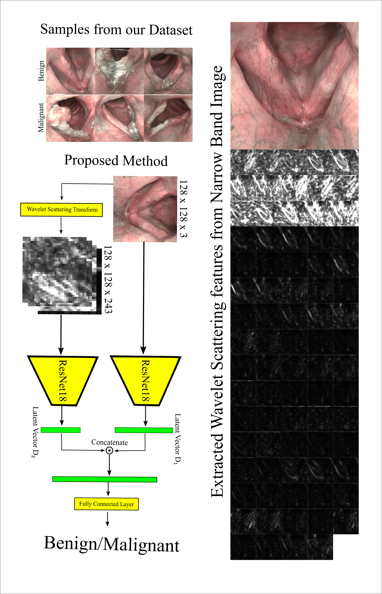

# Learning Robust Representation for Laryngeal CancerClassification in Vocal Folds from Narrow Band Images
<p align="center">
  
</p>

This repo covers the implementation of the paper submitted to MIDL 2022:  
(
## Loss Function
The loss function [`SupConLoss`](https://github.com/HobbitLong/SupContrast/blob/master/losses.py#L11) in `losses.py` takes `features` (L2 normalized) and `labels` as input, and return the loss. If `labels` is `None` or not passed to the it, it degenerates to SimCLR.

Usage:
```python
from losses import SupConLoss

# define loss with a temperature `temp`
criterion = SupConLoss(temperature=temp)

# features: [bsz, n_views, f_dim]
# `n_views` is the number of crops from each image
# better be L2 normalized in f_dim dimension
features = ...
# labels: [bsz]
labels = ...

# SupContrast
loss = criterion(features, labels)
# or SimCLR
loss = criterion(features)
...
```

## Hyperparameter tuning to find best latent vector dimension for Supervise Contrastive Loss. 

|D2 | AUPRC|
:----:|:---:|
| 8  | 0.75 | 
| 16 | 0.60 | 
| 32 | 0.69 | 
| 64 | 0.54 | 


## Hyperparameter tuning to find best latent vector dimension for Cross Entropy Loss.

|D2 | AUPRC|
:----:|:---:|
| 8  | 0.71 | 
| 16 | 0.62 | 
| 32 | 0.75 | 
| 64 | 0.70 | 


The `--data_folder` must be of form ./path/label/xxx.png folowing https://pytorch.org/docs/stable/torchvision/datasets.html#torchvision.datasets.ImageFolder convension.


## Usage

# Training Dual Branch with Supervise Contrastive loss
Example:
python main_supcon_scatter.py --augment all --dataset path --train_data_folder //media/debayan/cropped_CVs/1/train/ --val_data_folder //media/debayan/cropped_CVs/1/val/ --batch_size 32 --seed 10 --model_number CV_1

# Testing Dual Branch with Supervise Contrastive loss
Example:
python main_supcon_scatter_test.py   --model_folder /media/debayan/NBI/code/SupContrast-master/save/SupConScatter/path_models/SupConScatter_path_resnet18_modelnumber_CV_1_aug_all/ --data_folder //media/debayan/NBI/Dataset/cropped_CVs/1/test/ --expt_name SupCon_wvlet_2

# Training Dual Branch with Cross Entropy Loss
Example:
python main_ce_scatter.py --augment all --dataset path --train_data_folder //media/debayan/NBI/Dataset/cropped_CVs/1/train/ --val_data_folder //media/debayan/NBI/Dataset/cropped_CVs/1/val/ --batch_size 32 --seed 10 --model_number CV_1

# Testing Dual Branch with Cross Entropy Loss
Example:
python main_ce_scatter_test.py --latent 8 --model_folder /media/debayan/NBI/code/SupContrast-master/save/CEScatterLatentBalanced/path_models/CEScatterLatentBalanced_path_resnet18_modelnumber_CV_1_aug_all_latent_8/ --data_folder //media/debayan/NBI/Dataset/cropped_CVs/1/test/ --expt_name CE_latent_balanced_8


## Acknowledgement
```
We thank the code provided by Khosla et al (https://github.com/HobbitLong/SupContrast). We have used their code and modified it for our experiments. 

```
